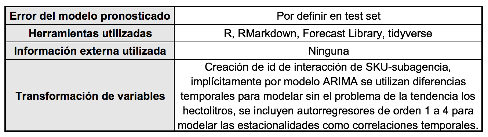

# Reporte de resultados del modelo predictivo para el Brewing Data Pub

### 1.  Primero nos damos a la tarea de cargar los paquetes necesarios para llevar a cabo el análisis

```{r setup, include=FALSE}
library(tidyverse)
library(readxl)
library(ggplot2)
library(scales)
library("TTR")
library(lubridate)
library(DataExplorer)
library(DT)
#library(sweep)
library(forecast)
set.seed(1990)

```

### 2. A continuación leemos los datos que fueron entregados por el equipo del Hackaton

```{r,message=FALSE,warning=FALSE}
###Leer los datos
com_data <- read_excel("./data/DemandForecast_Challenge (1).xlsx", sheet = "HistoricoVentas")

#pasar los headers a minusculas
colnames(com_data) <- tolower(colnames(com_data))
```


### 3. Se crean algunas variables dummy que puedan ser importantes para el módelos
```{r,message=FALSE,warning=FALSE}
#########################################################################################################
#                 FEATURE ENGINEERING AND DATASETS
#########################################################################################################
# TIME DUMMIES
com_data_new <- com_data %>%
  mutate(month = as.factor(month(com_data$mes)),
         year = as.factor(year(com_data$mes)),
         sku = as.factor(sku),
         subagencia = as.factor(subagencia))

# drop original date
com_data_new$mes <- NULL
#save(com_data_new, file=paste0(root,"./data/data_baseline.Rda"))
```

La estructura de los datos es de la siguiente forma:

```{r,echo=FALSE,message=FALSE,warning=FALSE}
datatable(com_data_new)

```


### 3. Analisis exploratorio
A continuación realizamos un analisis exploratorio para conocer mejor los datos.
Empezamos por gráficar el volumen de hectolitros por agencia, lo cual nos permite obsevrar la relación que cada agencia tiene con el total distribuido.
```{r,echo=T,message=FALSE,warning=FALSE,fig.width=12,fig.height=10}
### exploracion de info
#distribucion total de las agencias por volumen
by_agencia <- com_data %>%
 group_by(subagencia) %>%
 summarise(hectolitros=sum(as.numeric(hectolitros))) %>%
 arrange(desc(hectolitros))

#gráfica distribucion total de las agencias por volumen
plot_by_agencia <- ggplot(as.data.frame(by_agencia), aes(x = reorder(subagencia, -hectolitros), y = hectolitros)) +
 geom_bar(stat = "identity", fill = "dodgerblue3",width=0.8) +
 #geom_text(aes(label=prettyNum(hectolitros,big.mark=",",scientific=FALSE)), vjust=-0.3, size = 5) +
 geom_hline(aes(yintercept=mean(by_agencia$hectolitros)), color='red') +
 scale_y_continuous(name="Hectolitros", labels = comma) +
 labs(x="Subagencia",y="Hectolitros") + ggtitle(paste('Total de hectolitros por agencia para el intervalo',min(com_data$mes),'a',max(com_data$mes))) +
 theme_bw() +
 theme(axis.text.x = element_text(angle = 45, hjust = 1, size = 8))

#
plot_by_agencia

```

#### La gráfica por SKU nos permite observar claramente, que un reducido número de SKUS es responsable de la mayoria del volumen. A simismo nos percatamos de que varios SKUS reportan sus métricas en ceros.
```{r,echo=T,message=FALSE,warning=FALSE,fig.width=12,fig.height=10}

by_sku <- com_data %>%
 group_by(sku) %>%
 summarise(hectolitros=sum(as.numeric(hectolitros))) %>%
  filter(hectolitros > 3) %>%
 arrange(desc(hectolitros))


plot_by_sku <- ggplot(as.data.frame(by_sku), aes(x = reorder(sku, -hectolitros), y = hectolitros)) +
 geom_bar(stat = "identity", fill = "dodgerblue3",width=0.8) +
 #geom_text(aes(label=prettyNum(hectolitros,big.mark=",",scientific=FALSE)), vjust=-0.3, size = 5) +
 geom_hline(aes(yintercept=mean(by_sku$hectolitros)), color='red') +
 scale_y_continuous(name="Hectolitros", labels = comma) +
 labs(x="SKU",y="Hectolitros") + ggtitle(paste('Total de hectolitros por SKU para el intervalo',min(com_data$mes),'a',max(com_data$mes))) +
 theme_bw() +
 theme(axis.text.x = element_text(angle = 45, hjust = 1, size = 8))

plot_by_sku

```


#### A continuación estudiaremos las graficas de series de tiempo agregadas para entender su estacionalidad, tendencia, y comportamiento relativo. 
```{r,echo=T,message=FALSE,warning=FALSE,fig.width=12,fig.height=10}
#en funcion del tiempo
by_agencia_year <- com_data %>%
 group_by(mes) %>%
 summarise(hectolitros=sum(as.numeric(hectolitros)))


plot_by_agencia_year <- ggplot(as.data.frame(by_agencia_year), aes(x = mes, y = hectolitros)) +
 geom_line(stat = "identity", fill = "dodgerblue3",width=0.8) +
 scale_y_continuous(name="Hectolitros", labels = comma) +
 labs(x="Fecha",y="Hectolitros") + ggtitle(paste('Serie de tiempo agregada de',min(com_data$mes),'a',max(com_data$mes))) +
 theme_bw()

plot_by_agencia_year


#analisis
total_ts <- ts(by_agencia_year$hectolitros, frequency=12, start=c(2013,1))
decompose_total_ts <- decompose(total_ts)
plot(decompose_total_ts)


by_agencia_sku <- com_data %>%
 group_by(subagencia,sku) %>%
 summarise(hectolitros=sum(as.numeric(hectolitros))) %>%
 arrange(desc(hectolitros))


by_agencia_year_mes <- com_data %>%
 group_by(mes,subagencia) %>%
 summarise(hectolitros=sum(as.numeric(hectolitros))) %>%
 arrange(desc(hectolitros))

```


#### A Continuación estudiaremos un subconjunto aleatorios de las series de tiempo individuales para conocer a detalle su compartamiento.

```{r,echo=T,message=FALSE,warning=FALSE,fig.width=12,fig.height=10}

### Create 100 plots

x<-com_data
x$unique_id<-paste0(x$subagencia,x$sku)

#unique(by_agencia_year_mes$Subagencia) 

rand<-sample(x$unique_id,50)
explore<-subset(x,x$unique_id %in% rand )

ggplot(explore, aes(x=mes,y=hectolitros)) +
  geom_line(aes(group=unique_id)) +
  facet_wrap(~ unique_id, scale="free") 

```
Se puede observar de la gráfica anterior que los datos son bastante irregulares, y que existen SKUS con comprtamientos atipicos, o SKUS con fechas de inicio o fin.

#### Filtrando aquellos  SKUS que tengan valores superior a 2000 HL

```{r,echo=T,message=FALSE,warning=FALSE,fig.width=12,fig.height=10}
# Select 100 random (Agencia-SKU) con filtro de Hectolitros arriba de 1000
rand<-sample(x$unique_id,500)
explore<-subset(x,x$unique_id %in% rand )

ggplot(subset(explore, explore$hectolitros>2000), aes(x=mes,y=hectolitros)) +
  geom_line(aes(group=unique_id)) +
  facet_wrap(~ unique_id, scale="free") 
```
Los SKUS mas relevantes, pareecen comportarse de manera mas regular. 


### Series de tiempo agrupadas por agencia, donde observamos estacionalidades claras. (Se escogen 20 agencias al azar)

La siguiente gráfica muestra que a nivel agencia, las graficas son mas regulares y demuestran patrones clasicos de estacionalidad y tendencia. 

```{r,echo=T,message=FALSE,warning=FALSE,fig.width=12,fig.height=10}
rand<-sample(by_agencia_year_mes$subagencia,20)
#agregado por agencias  
ggplot(subset(by_agencia_year_mes, by_agencia_year_mes$subagencia%in%rand), aes(x=mes,y=hectolitros)) +
  geom_line(aes(group=subagencia)) +
  facet_wrap(~ subagencia, scale="free") 

```


### 4. Modelo

Después del análisis de los datos y de un riguroso análisis matemático, descubrimos que la función objectivo debería minimizar los errores absolutos y no como comúnmente es el caso los errores cuadráticos.
Creemos que el método de evaluación del Hackathon está formulado en este sentido debido a la cantidad de datos atípicos que toman el valor cero.

Por el momento decidimos implementar de forma local para cada interacción de SKU y subagencia un __modelo autorregresivo integrado de medias móviles__ (ARIMA), especificando el método de optimización a través de la minimización de los errores cuadráticos, estos 8,943 modelos locales integran el ensamble. La ventaja de utilizar un modelo de este tipo para cada una de las posibles combinaciones consiste en poder capturar la variabilidad, estacionalidad y tendencia específica para cada posible combinación; aún aquellas que presentran un patrón atípico o aberrante.

En un futuro se podría realizar un modelo ARIMA para la mediana a fin de optimizar de forma directa la métrica de evaluación de los modelos. 

Los archivos que contiene los modelos individuales y la base con las predicciones para cada Marzo, Abril, Mayo de 2018 se anexan. A continuación presentamos algunos resultados indicativos.

```{r}
# #crear id unico
# com_data$unique_id <- paste0(com_data$subagencia,com_data$sku)
# 
# #rand<-sample(com_data$unique_id,5)
# #com_data2 <- filter(com_data, unique_id %in% rand)
# 
# base_line <- function(series){
#   fit <- auto.arima(series)
#   return(fit)
# }
# 
# create_ts <- function(id,db){
#   series <- filter(db, unique_id == id)
#   series <- ts(series, frequency=12, start=c(2013,1))
#   series <- series[,"hectolitros"]
#   return(series)
# }
# 
# #head(create_ts("1021700000203", com_data2))
# #test<-create_ts("1021700000203", com_data2)
# resultado_final<-data_frame(unique_id=as.character(), 
#                             marzo=as.numeric(), abril=as.numeric(), mayo=as.numeric())
# for (x in unique(com_data$unique_id)){
#   rm(fit)
#   print(x)
#   ts<-create_ts(x,com_data)
#   print(head(ts))
#   fit<-base_line(ts)
#   #fit<-base_line(create_ts(unique_id,com_data2))
#   name<-as.character(x)
#   print(fit$coef)
#   save(fit, file=paste0("./models/",name,".rda"))
#   resultado_final <- rbind(resultado_final, cbind(x, as.numeric(forecast(fit,3)$mean)))
# }
# resultado_final$mes<-c("Mar-18","Apr-18","May-18")
# resultado_final <- mutate(resultado_final, subagencia=substr(as.character(x), 1, 5), 
#                                            sku=substr(as.character(x), 6, nchar(as.character(x))) )
# save(resultado_final, file="resultado_final.rda")

load("resultado_final.rda")

```

### 5. Evaluación del modelo

La evaluacioón de los modelos se hizo de forma individualizada para cada una de las interacciones SKU-subagencia, no separamos los datos del último mes para validar los modelos porque en muchos de los modelos autorregresivos el lag de orden 1 demostró ser un gran predictor.

Lo que nosotros sugerimos es entrenar estos modelos "online", evaluándolos usando Cross Validation con ventanas móviles.

```{r,echo=T,message=FALSE,warning=FALSE,fig.width=12,fig.height=10}
### Predicción gráfica
forecast_kam<-function(sku,subagencia,n=3){
 unique_id <- paste0(subagencia,sku)
 load(paste0("./models/", unique_id,".rda"))
 return(forecast(fit,n))
}

# Modelo para el par de Agencia y Skuss mas relevante
top1_sku<- "00000025"
top1_age<- "10129"
plot(forecast_kam(top1_sku, top1_age), main = paste0("Agencia: ",top1_age, " Sku: ", top1_sku))
accuracy(forecast_kam(top1_sku,top1_age))

# Modelo para el par de Agencia y Skuss aleatorio
rand_sku<- sample(com_data$sku,1)
rand_age<- sample(com_data$subagencia,1)
plot(forecast_kam(rand_sku,rand_age), main = paste0("Agencia: ",rand_age, " Sku: ", rand_sku))
accuracy(forecast_kam(rand_sku,rand_age))

# Modelo para el par de Agencia y Skuss aleatorio
rand_sku<- sample(com_data$sku,1)
rand_age<- sample(com_data$subagencia,1)
plot(forecast_kam(rand_sku,rand_age), main = paste0("Agencia: ",rand_age, " Sku: ", rand_sku))
accuracy(forecast_kam(rand_sku,rand_age))
```



